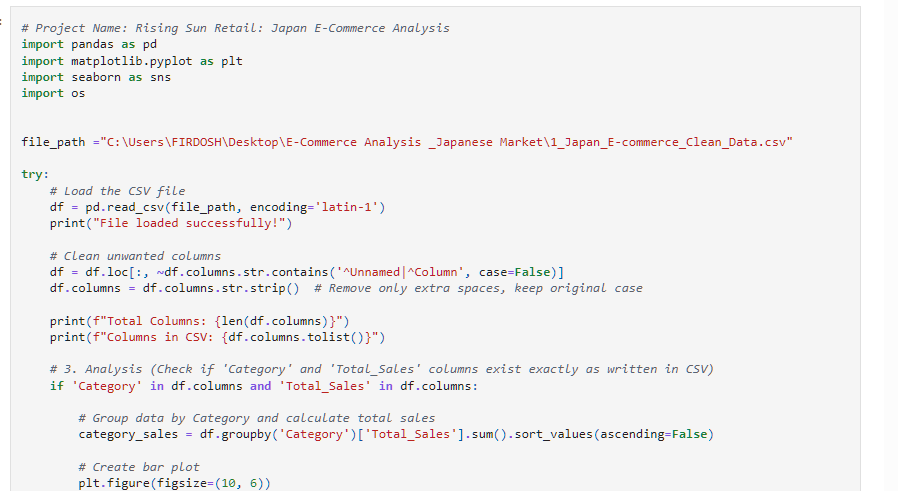
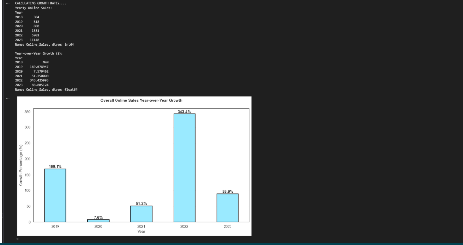
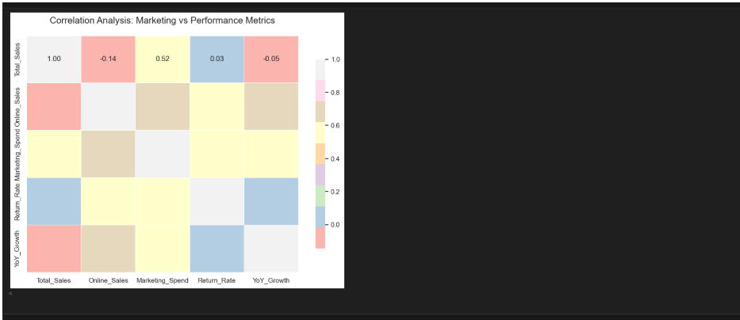

# Japan-Ecom-Analysis

End-to-End Analysis of Japan's E-commerce market (2022-2023) using Excel for data cleaning and Python for exploratory data analysis (EDA).

# Japan E-commerce Market Analysis (2022-2023)

This project focuses on analyzing the E-commerce landscape in Japan, covering sales trends, regional performance, and marketing efficiency. The analysis is performed using Excel and Python.

## Project Workflow

1. Data Cleaning (Excel): Handled missing values, formatted currency/units, and prepared the raw data for analysis.
2. Exploratory Data Analysis (Python): Used Pandas and Matplotlib to identify growth patterns and ROI metrics.
   
### Data Preview & Initial Setup**

# Key Insights

- Top Region: Kanto region dominates the sales share.
- High ROI Segment: Marketing ROI reached a peak of 5.4x in specific electronics categories.
- Category Growth: High growth observed in the 'Fashion' and 'Electronics' sectors during Q4

### Analysis Visualizations

# Tools Used

- Excel: Initial data cleaning and structuring.
- Python (Jupyter Notebook): Data profiling, trend analysis, and visualization.
- Libraries: Pandas, Matplotlib, Seaborn.

# Files in this Repository

- 1_Japan_E-commerce_Clean_Data.csv: The cleaned dataset used for analysis.
- Japan_Ecom_Analysis.ipynb: Detailed Python code for EDA and insights.
